# A `nbgrader` tutorial
Working with Jupyter Notebooks/nbgrader as a tool for handling student
assignments entail a development and a assignment process.

The development process is very similar to software development. During
development use of a version control system like `git` is beneficial.
`git` gives helps to keep track of the notebook versions bound to be released as
assignments. 

The assignment process is conceptualized in the figure
below. The teacher create an assignment based on a Jupyter Notebook. The students collect
the Jupyter Notebook and submit their version of the notebook. The
teacher collects the notebooks and generates feedback.
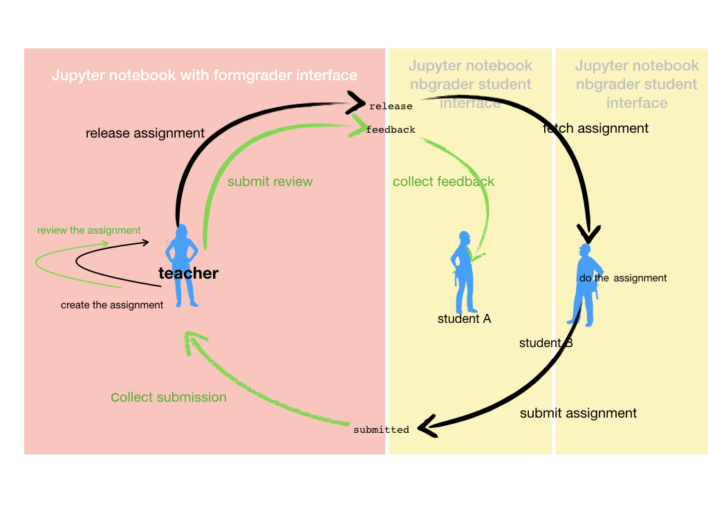

## Making an assignment of a Jupyter Notebook
To get a feel of nbgrader and a better understanding of the process,
follow the instructions. In the tutorial you go through the different
steps as a teacher. You will switch to be student, do the assignment and
submit it. You fetch the your submitted answer in the role as teacher,
and generate feedback.

We will use the CodeRefinery notebook demonstrating how you can estimate $\pi$.

### Upload a notebook to the nbgrader server.
1.  `git clone` the KJ1041 repository to your local computer. Under
the subdirectory `source`, there is a directory `problem_set_0`. Here
you find a Jupyter Notebook which you can upload and use for creating an
assignment.
2. Logon to the nbgrader interface for a teacher, https://grader-testemne.testapps.stack.it.ntnu.no/
3. Create a problem set by creating a folder in the subdirectory
   `course/source'. Give the problem set folder a unique name.
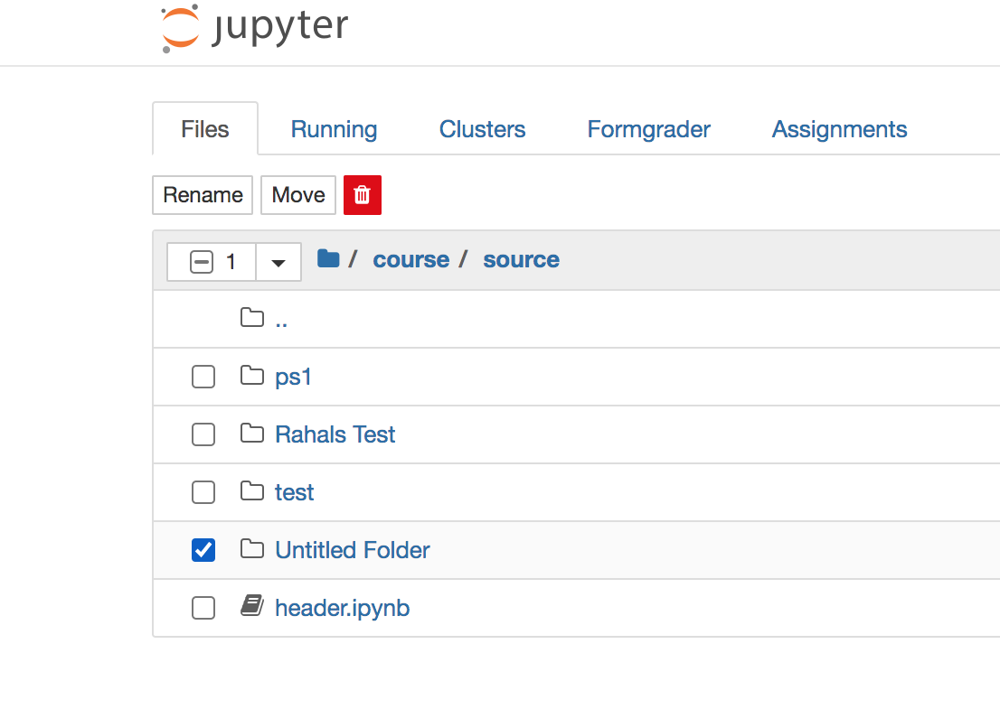
4. Step into this folder and upload the notebook `A computational
   narrative about PI.ipynb`. The notebook is under
   `source/problem_set_0` in your local cloned repository.
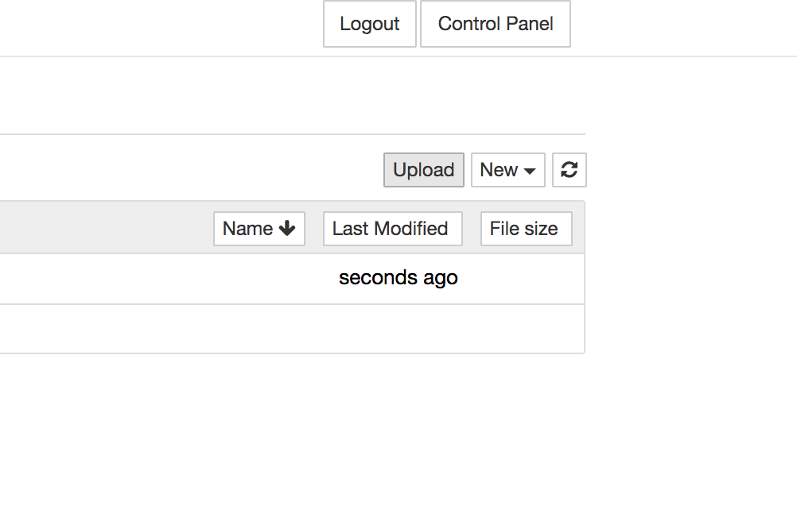

### Mark the Jupyter Notebook as an assignment
5. First you will classify the cells. Open the notebook. From the tab `view` select `Create Assignment`.
   You will now be able to classify notebook cells as:
- Read Only
- Manual graded answer
- Manual graded  task
- Autograded answer (for code cell only)
- Autograder tests (for code cell only)

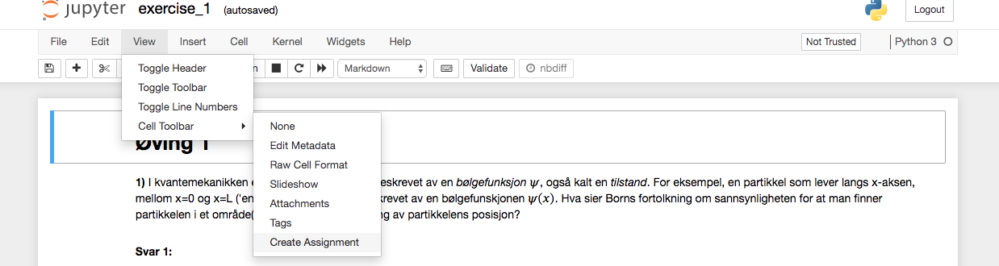

Note that both the markdown cell with the title "Redo.." and the code
cell which loads the web page are marked "Read-Only". This is left over
meta data from a previous session creating an assignment. It will
normally not happen, as a fresh notebook will be without this meta
information. Here it serves to illustrate that both markdown and code
cells can be read-only. By executing the read-only code-cell, the output
will show the web page on how to estimate $\pi$

The options for defining the type of cell are on the right side of each
cell. Note that output cells, like the frame with the web page do not
have any classifying option:
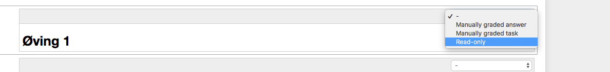

6. Mark all titles as `Read Only`. Titles are markdown cells where the
   text starts with one or more `#`.

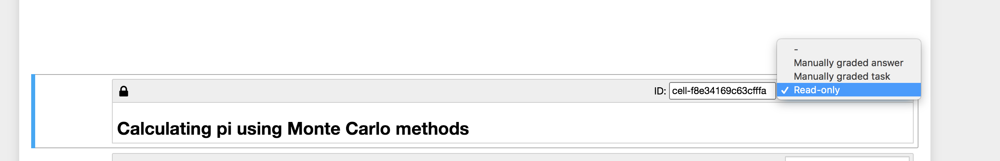

7. Classify each cell that stats a task as either a 'Manual graded
   answer' or a 'Autograded answer'. Markdown cells are 'Manual graded
   answer' requiring a written answer. Code cells are 'Autograded
   answers', except the plotting procedure which should be 'Manual
   graded task'. The plotting procedure is
   difficult to test. 
   
   The difference between 'Manual graded answer' and 'Manual graded
   task' is explained on [readthedocs.](https://nbgrader.readthedocs.io/en/stable/user_guide/creating_and_grading_assignments.html#manually-graded-task-cells)

8. Give all cells which are marked either as a title or as a task, a readable id.

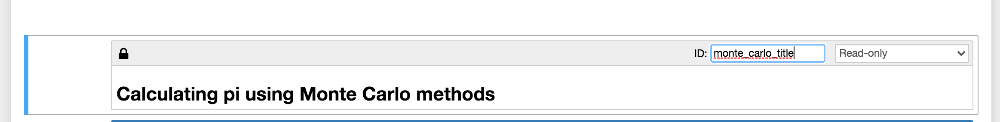

9. Add code tests which verify calculations.

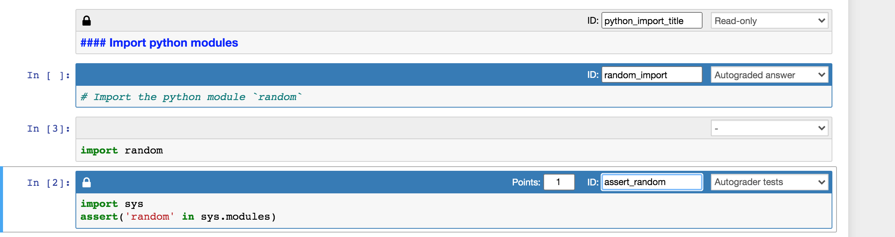
For the import statement use:
```python
import sys
assert('random' in sys.modules)
```

For the num_point assignment use:
```python
assert(num_points == 1000) 
```
You could try to execute the assert statement before executing the code
cell setting num_points, or do `assert(num_point == 10000)` just to see
how an error will look like.

For the function, use:
```python
assert(len(points) == 1000) 
```

For the fraction, use:
```python
### BEGIN HIDDEN TESTS
import unittest

class TestNotebook(unittest.TestCase):
    def test_fraction(self):
        self.assertAlmostEqual(4*fraction, 3.1,delta=0.1)

assert(unittest.main(argv=[''], verbosity=2, exit=False))
### END HIDDEN TESTS
```

10. Assign points to each task. Points for autograded tasks are set in
    the notebook cell with the test.

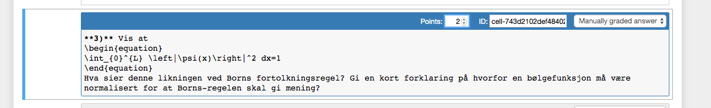

11. Save the notebook.

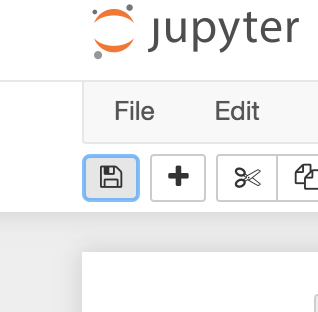

12. Close the browser fan with the notebook and shutdown it down through
    the notebook file browser interface.
    
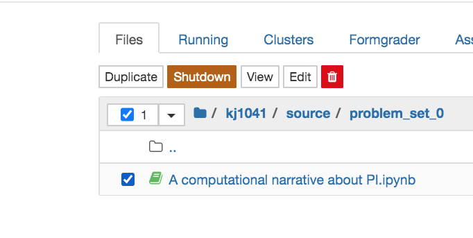


### Release notebook
13. Select `formgrader` from the notebook file browser interface. The
    interface should list your added notebook/assignment.
    
    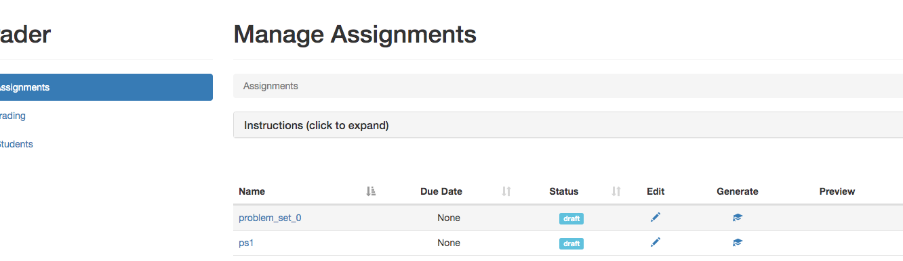
    
14. Generate an assignment by pressing the `generate` button. If
    successful, the generation will inform through a pop up dialog that
    it was successful. If not successful, a similar pop-up dialog will
    inform you that there was an error
    
    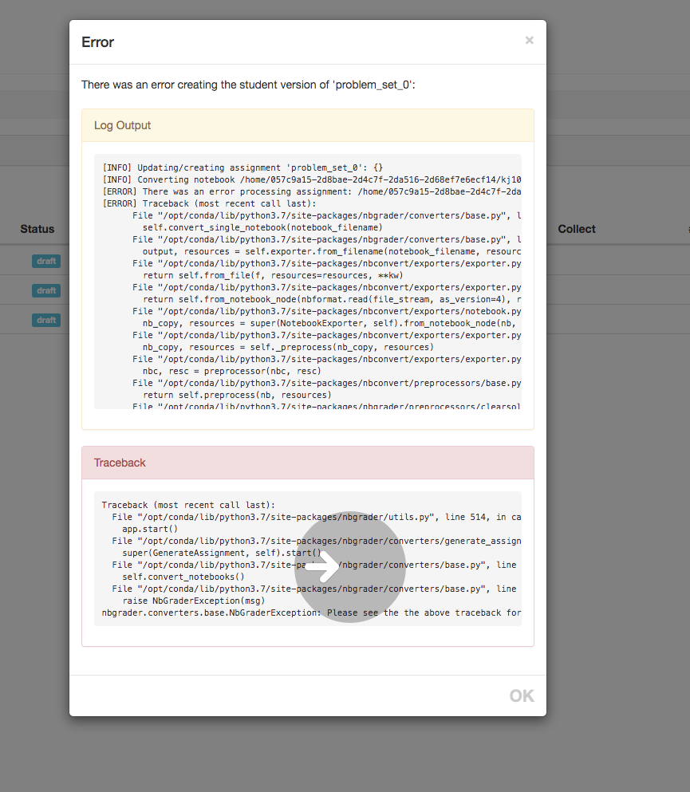
    
15. Release the assignment by pressing the `release` button

### Answering the assignment as a student
To logon on to the student web interface point your browser to:
https://testemne.testapps.stack.it.ntnu.no
    
Select `assignments` to get the list of released assignments. Your recently released assignment should be visible under 'Released Assignments'.
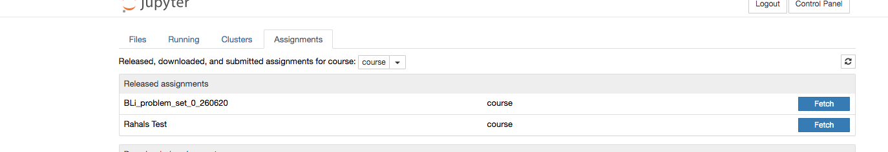
1. Select `Fetch` to get the assignment.
2. The assignment gets listed under 'Downloaded assignments'. Step into it and the notebook(s) get listed. Try to run `Validate` on the unanswered assignment. You will get 
   a dialog showing the result of the validation:
   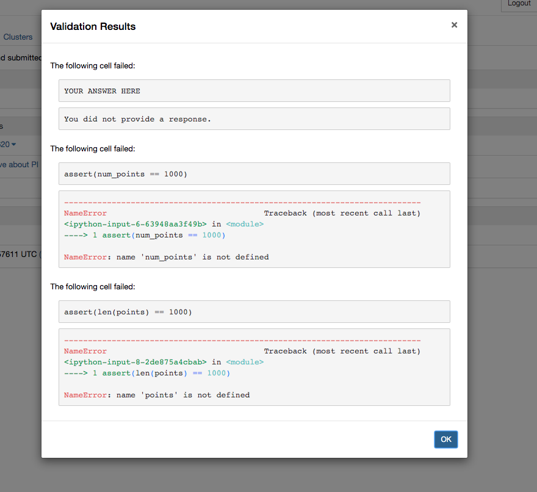


3. Do the assignment, with the help from in the in-lined web page from
   CodeRefinery. When you are done with the assignment, step into the
   `assignment` page.
   
4. Select `validate`. A dialog pops up and tells you that the validation
   is successful (if you have done all the tasks, with the exception of
   the last task 'Estimation of pi').
   
   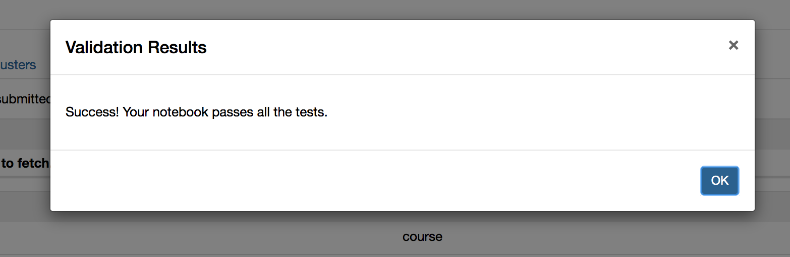
   
   The validation button becomes green after a successful validation.
   
   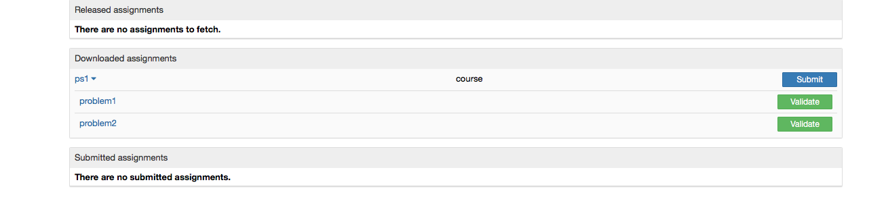

5. Submit the assignment by selecting `submit`.

   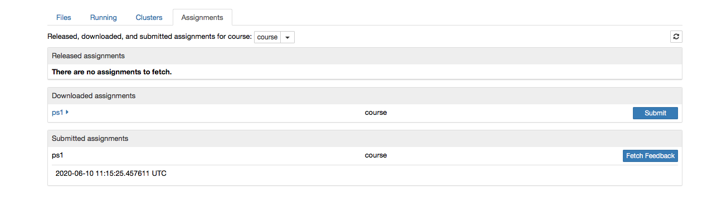
  
  
### Collecting answers and providing feedback
Now you take on the role as teacher again. You will collect the
submissions, grade the answers and provide feedback.

Logon on to the teacher interface, https://grader-testemne.testapps.stack.it.ntnu.no/

1. Besides the symbol for `release` you will find the symbol for
   `collect` - a cloud with an arrow pointing down. Select `collect`.
   
   
   
   A dialog pops up to show you the result of the collect operation.
   
   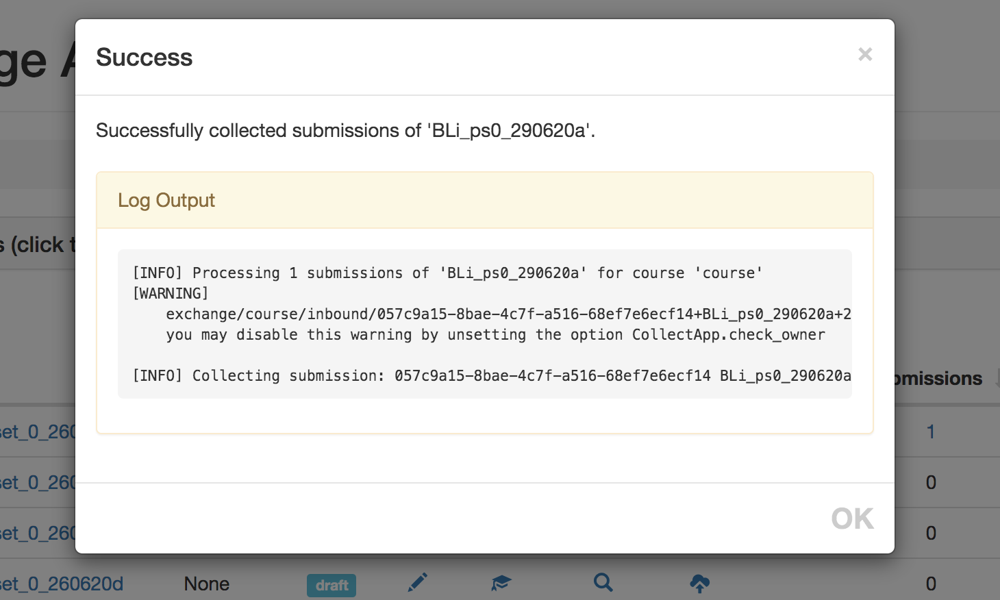

2. The line with symbols are extended with the number of submissions, a
   symbol for `generate feedback` and a symbol for `release feedback`.
   
   
   
3. Start grading by selecting the number under submissions. You will
   enter the 'Manage Submissions' page.
   
   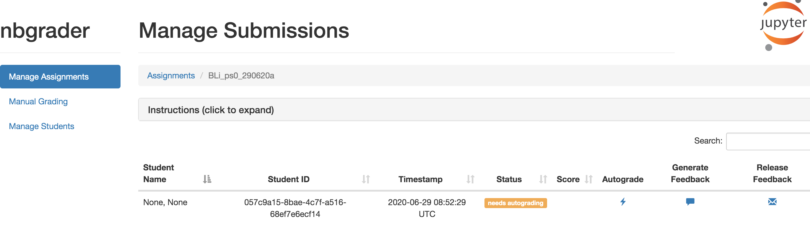

4. Do autograding by selecting the `autograde` icon. Successful grading
   result in a dialog reporting success.
   
   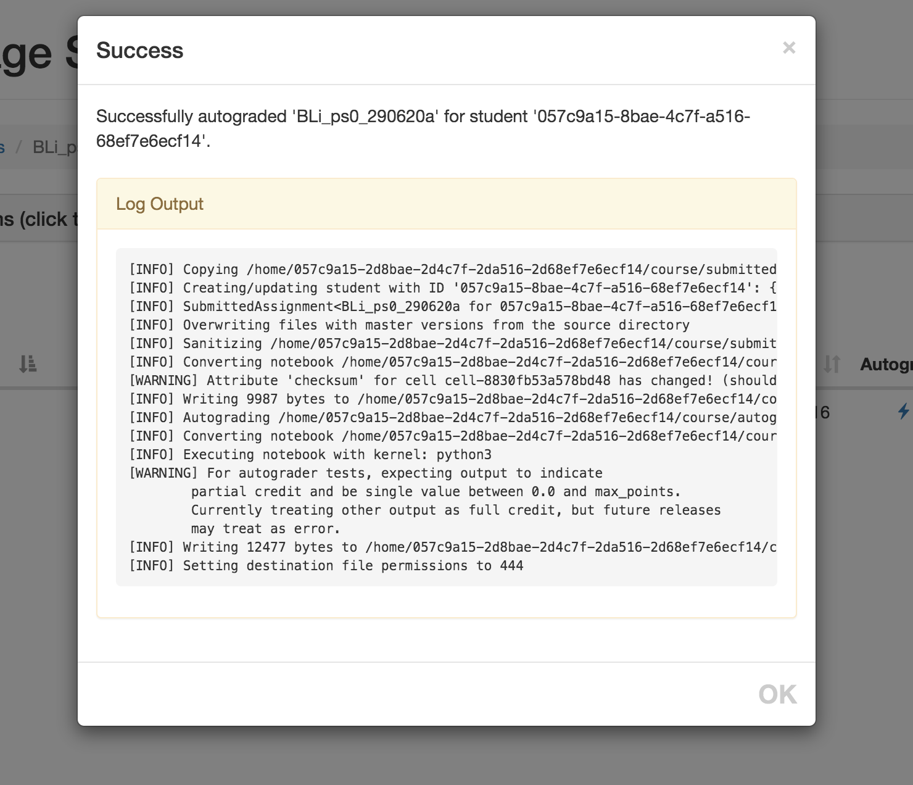

5. The submissions have changed status from 'needs autograding' to
   'needs manual grading'. The score also shows. In the example pictured
   the score is 10/16. 6 of the 10 points comes from the tests that has
   accompanied the assignment. The last 4 points comes from the test
   marked 'HIDDEN'. This test is executed as part of the autograding,
   but not as part of the students validation, since the test has been
   left out of the notebook passed to the students.
   
   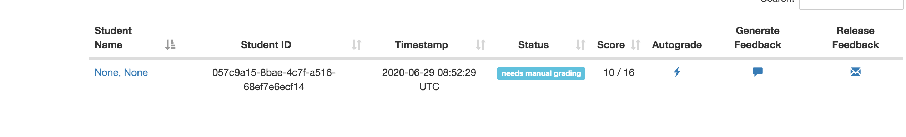
   
6. Do manual grading. You select 'Manual Grading' on the left side of
   the 'Mange Submissions' page. From here you select the assignment,
   then the problem set, and at last a submission.
   
   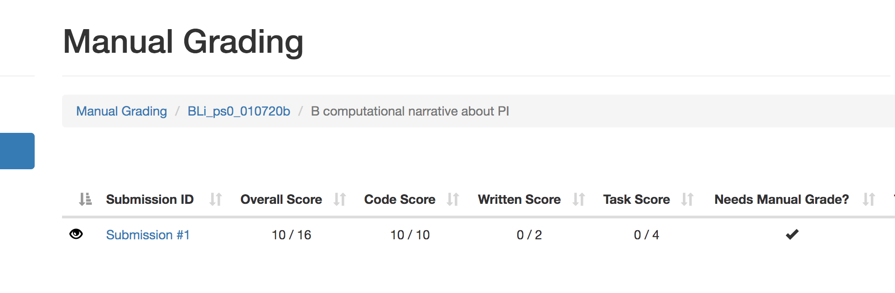
   
7. Set points on the manual tasks. On all tasks either autograded or
   manually graded you can add extra points, or retract points. You may
   also comment on each task. Note that the last task which have a
   hidden auto-test, has the test code added as part of the feedback. This
   can be a way to show a longer answer/code. 
   
   When there are several submissions, you can step between the
   submissions, with the 'Prev' or 'Next' arrow (upper left and
   right corner). There is also a question mark (lower right corner)
   which list keyboard shortcuts for navigating in the submission.
   'Next' brings you back to the 'Manual Grading' page. The score is
   updated.

8. To send the feed back to the student you first generate the feedback,
   then you release the feedback. Both operations pop up a dialog.
  
   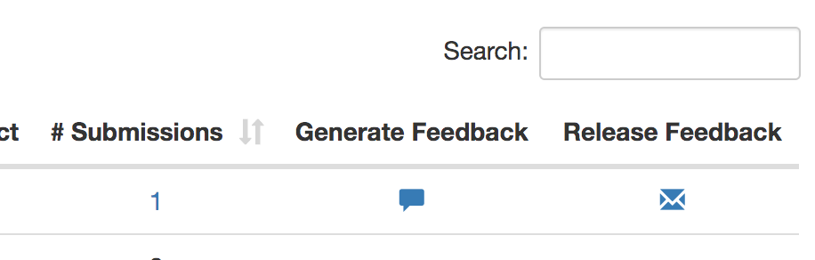
  
  
### Fetching feed back as a student
1. Login on the student interface, https://testemne.testapps.stack.it.ntnu.no.
2. On the 'Assignment' page under 'Submitted assignments' feedback will
   be stated as 'available' for assignments where feedback are released.
   
   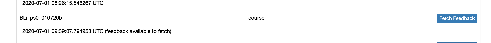

3. Select `Fetch feedback` to get the available feedback.
4. The feedback can be viewed by selecting `view feedback`

   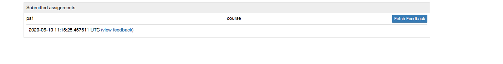
  
5. Browse the HTML page showing the feedback to the student.t
